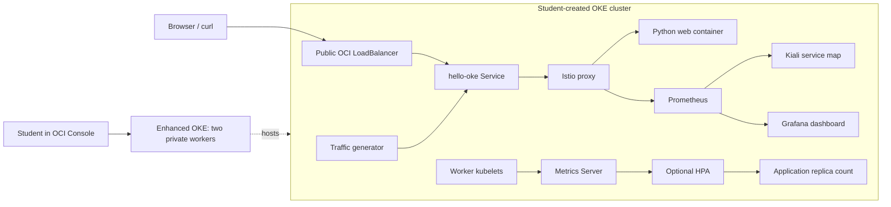

# OKE Console Bootcamp: Create, Deploy, Observe, and Scale

In this lab, you create an Oracle Kubernetes Engine (OKE) cluster through the OCI Console, then deploy, monitor, and scale an application on it. You'll deploy an application with Helm, observe its traffic and performance with Istio, Prometheus, Kiali, and Grafana, and change the number of application replicas manually. These are commonly used tools and practices for managing applications on Kubernetes. Autoscaling and pod recovery are optional extensions.

Luna allocates your temporary OCI account, compartment, region, and desktop. The new GitLab pipeline checks that allocation. **During this lab, you use OKE’s Quick Create (quickstart) workflow in the OCI Console to create the cluster, networking, and worker nodes.**

Allow **90–120 minutes of hands-on time**, plus an optional 30-minute lecture. Cluster provisioning time and regional capacity vary; this schedule needs a classroom pilot.

Your cluster has two **worker nodes**, the machines that run pods. Each application **pod** contains the Python app and an Istio proxy. A **Deployment** declares how many app pods should run, and its ReplicaSet maintains that count. A **Service** gives clients a stable way to reach those pods as individual pods change.

OKE manages the Kubernetes control plane that coordinates your cluster. You'll add Istio to this cluster to manage application traffic through proxies that run alongside your application containers.

This lab assumes you can navigate a terminal, copy commands, and edit a YAML value. By the end, you should be able to:

- Create an enhanced OKE cluster, inspect its networking, and enable resource metrics.
- Configure kubeconfig and verify two Ready worker nodes.
- Customize and deploy an application with Helm, then explain how its Service reaches its pods.
- Identify the application container and its Istio proxy, and follow traffic in Kiali.
- Interpret baseline traffic and compare Grafana readings during manual scaling.
- Scale app replicas manually and explain why this does not add worker nodes.
- Distinguish readiness from liveness and use pod events to investigate a health warning.

If time permits, use the **Horizontal Pod Autoscaler (HPA)** to adjust replicas from CPU measurements, or observe Kubernetes replacing a deleted pod. Neither extension is required to complete the lab.

Run commands in a **Bash terminal on the Luna desktop**. Keep session credentials private.

Materials revision: `console-lab-2026-10-05.2`. Your checkout and Luna instructions must show this same revision.

Record checkpoints in the [completion sheet](docs/completion-sheet.md).

## Architecture



The monitoring arrows show the flow of data; Prometheus initiates scrapes, and Kiali/Grafana query it. Dashboards use localhost port-forwards. Metrics Server supplies the optional HPA independently of Prometheus. Read the [component guide](docs/architecture.md).

## Schedule

| Approximate duration | Exercise | What you will demonstrate |
|---|---|---|
| 40–70 minutes | 1. Create and connect | Create OKE and networking, enable add-ons, download materials, configure kubeconfig, verify metrics |
| 18 minutes | 2. Install mesh and monitoring | Install Istio, Prometheus, Kiali, and Grafana with Helm |
| 12 minutes | 3. Configure and deploy | Customize two application replicas with an OCI LoadBalancer |
| 8 minutes | 4. Observe traffic | Interpret Kiali and Grafana |
| 7 minutes | 5. Scale manually | Change app replicas from two to four and back |
| 5 minutes | 8. Debrief | Explain your cluster and application observations |

Steps 6 and 7 are optional. Reserve at least 15 additional minutes for HPA or five for pod recovery. Start an extension only after completing the core, with enough session time left to finish and reset its load. These are provisional estimates; record actual cluster wait time during the pilot.

## What creates each resource?

| Owner | Responsibility |
|---|---|
| Luna Shared Platform | Allocates the student OCI tenancy/account, compartment, region, credentials, and desktop according to the lab's platform configuration |
| New GitLab project | Receives the allocation, checks the identity/compartment/region and OKE version options, then records a ready student environment |
| Student, in OCI Console | Creates the enhanced OKE cluster, VCN, subnets, gateways, managed node pool, and two workers; enables metrics add-ons |
| Student, with Helm | Installs mesh and monitoring, the application, traffic generator, and optional HPA |
| OKE cloud controller | Creates the application's OCI load balancer when the student deploys its Kubernetes Service |

The [GitHub repository](https://github.com/chiphwang1/oke-console-bootcamp) distributes the learner materials. The [new GitLab project](https://gitlab.hap.demo.us-phoenix-1.oci.oraclecloud.com/luna-labs/ospa/oke-console-bootcamp) contains the same release plus CI for the Luna allocation handoff. See [CI administration](docs/gitlab-ci.md). No Terraform is needed: the existing allocation is provided by Luna, while all infrastructure previously managed by this lab's Terraform is now created by the student.

## Before hands-on: start your student environment

Launch the new Luna lab configured by your instructor. Wait for the desktop and assigned OCI credentials to become available. An empty OKE cluster list is expected at this stage. The [instructor guide](docs/instructor-guide.md) explains the allocation handoff and prerequisite checks.

## 1. Create your cluster and confirm your connection — 40–70 minutes

Use each code block's **Copy** button, then **Edit → Paste** in the Luna terminal (or **Ctrl+Shift+V**, not **Cmd+V**). If nothing pastes, see [Copy and paste in Luna](README.md#copy-and-paste-in-luna) in Appendix A.

In a **Bash terminal** on your Luna desktop, download the lab repository. Keep this window open as **terminal 1**:

```bash
git clone --branch console-lab-2026-10-05.2 --single-branch \
  https://github.com/chiphwang1/oke-console-bootcamp.git "$HOME/oke-console-bootcamp" &&
  cd "$HOME/oke-console-bootcamp"
```

### Find your lab login and compartment

Sign in with your temporary Luna account:

1. Double-click **Luna-Lab** (or **Luna Lab**) on the desktop. Keep this session-information page open.
2. Under **Quick Links**, click **OCI Console** to open the sign-in tab.
3. Copy your assigned username and password from **Credentials** into **User Name** and **Password**. **Do not use the SSO Link.**
4. Paste with **Ctrl+V** or right-click **Paste**, then click **Sign In**.
5. Return to Luna Lab and note your **Compartment Name** and **region** under **Lab Details** (or the **Oracle Cloud** section). Use these to select your cluster.

If session details are missing, stop and ask the instructor; do not use a personal account or another learner's credentials. See [Oracle's Luna login instructions](https://docs.oracle.com/en/learn/build-cloud-native-java-applications-with-micronaut-and-graalvm/lab1/configure-db-access.html); its database exercises do not apply here.

### Create your own cluster in the OCI Console

Complete [Create an OKE cluster](docs/create-cluster.md) now. It walks you through Quick Create, the network and worker settings, and enabling Cert Manager and Kubernetes Metrics Server. Return here when the cluster and both nodes are Active and the add-ons are installed.

### Open your cluster and configure access

Use the assigned compartment and region shown in Luna Lab.

Your **kubeconfig** tells kubectl which cluster to connect to and how to authenticate. Create it at `~/.kube/config` on your Luna desktop—the default location used by kubectl and Helm. Follow the Console route below; the [access guide](docs/cluster-access.md) is for additional authentication details or troubleshooting.

1. Select your **region** in the OCI Console. Open the upper-left navigation menu → **Developer Services → Containers & Artifacts → Kubernetes Clusters (OKE)**. See [Oracle's navigation instructions](https://docs.oracle.com/en-us/iaas/Content/ContEng/Tasks/list-clusters.htm).
2. Open the **Compartment** filter. Expand the compartment hierarchy if needed and select the exact **Compartment Name** shown on your Luna Lab page. Do not choose a compartment just because its name begins with `luna`, and do not use the tenancy root.
3. Open the cluster **you created in the previous exercise**. Confirm its name and that its status is **Active**.
4. On your cluster's details page, select **Access Cluster** (under **Actions** if necessary), then **Local Access**. “Local” means the terminal on your Luna desktop, not your personal laptop.
5. In **terminal 1**, prepare the kubeconfig directory:

   ```bash
   umask 077
   mkdir -p "$HOME/.kube"
   ```

6. Copy the displayed `oci ce cluster create-kubeconfig` command from **Access cluster → Local Access**. Before running it:

   - Use `--file "$HOME/.kube/config"` (the default location).
   - Keep **your cluster's** OCID, region, and endpoint.
   - This lab uses `--kube-endpoint PUBLIC_ENDPOINT`, matching the public API endpoint you selected in Quick Create.
   - Follow the [desktop OCI authentication settings](docs/cluster-access.md#generate-your-kubeconfig-on-the-desktop).
   - Do not add `--overwrite`.

   Run the edited command in **terminal 1** to create your kubeconfig.

### Verify your kubeconfig

Use the default file for all lab commands; no `export KUBECONFIG` is needed. If you previously set it to another path, the first command below clears that override.

```bash
unset KUBECONFIG
ls -l "$HOME/.kube/config" &&
test -s "$HOME/.kube/config" &&
kubectl config get-contexts &&
kubectl config current-context
```

If the file is missing or empty, return to step 6 above to generate it at `~/.kube/config`. Do not create an empty file or continue to preflight.

### Check cluster readiness

In terminal 1, run preflight from the repository root:

```bash
bash scripts/check-ready.sh
```

Preflight checks files, tools, API access, version compatibility, two Ready workers, and resource metrics using your current kubeconfig context. It makes no cluster changes. OCI CLI must remain available to generate authentication tokens.

Expect these lines and numeric CPU/memory readings (values vary):

```text
PASS Workers: 2/2 Ready and not cordoned
PASS Resource metrics: numeric CPU and memory for both workers
```

Continue only after `Preflight passed`. On `FAIL`, follow its message or ask the instructor; see [preflight troubleshooting](README.md#preflight-fails).

Load the chart-version variables, download the five pinned Helm charts, and check the files. Downloads are saved in `.lab-cache/charts/`; these commands do not install anything in the cluster:

```bash
source helm/versions.env
bash scripts/prepare-charts.sh --download &&
bash scripts/prepare-charts.sh --check
```

Expect five `PASS Prepared chart` lines from each successful command. Matching downloads are reused if you rerun it. On failure, follow the message or ask for help. The Git tag pins lab files, and `helm/versions.env` pins upstream charts. The instructor must publish the tag before distributing the lab.

### Confirm your prepared connection

After preflight and all five chart checks pass, inspect the workers and their resource usage in terminal 1:

```bash
kubectl get nodes
kubectl top nodes
```

Expect two `Ready` workers and numeric CPU/memory readings. Keep terminal 1 open for later commands.

**Checkpoint:** identify the two workers and their CPU usage. Which file selects your Kubernetes connection, and which component supplies CPU metrics?

The selected context in `~/.kube/config` identifies the cluster and user. Metrics Server supplies the resource metrics used by `kubectl top` and this lab's HPA; Prometheus supplies the dashboard metrics. See [kubectl top node](https://kubernetes.io/docs/reference/kubectl/generated/kubectl_top/kubectl_top_node/).

## 2. Install Istio, Prometheus, Kiali, and Grafana — 18 minutes

### What the tools do

We install Istio and the monitoring tools first so they are ready to observe the application when it starts. This is the toolset chosen for this lab; Kubernetes applications can use other monitoring setups.

| Tool or component | Purpose in this lab | Setup |
|---|---|---|
| Helm | Installs and upgrades Kubernetes resources packaged as charts. | Already on the desktop |
| Istio | Adds proxies beside app containers to manage traffic and report request metrics. | You install it below |
| Prometheus | Stores Istio metrics for dashboard queries. | You install it below |
| Kiali | Maps service traffic, request rates, errors, latency, and workload health. | You install it below |
| Grafana | Charts metrics to compare baseline traffic, load, and scaling. | You install it below |
| Metrics Server | Supplies CPU and memory readings to `kubectl top` and CPU metrics to this lab's HPA. | You enable the OKE add-on in step 1 |
| Cert Manager | Manages TLS certificates; it is a dependency of this OCI-managed Metrics Server add-on. | You enable the OKE add-on before Metrics Server |
| HPA | Adjusts app replicas using CPU metrics; it does not add worker nodes. | Optional: enable in step 6 |

`kubectl` manages Kubernetes resources; OCI CLI authenticates the connection. Both are preinstalled. The [architecture diagram](docs/architecture.md) separates dashboard and HPA metrics paths.

Istio, Prometheus, Kiali, and Grafana are upstream open-source tools installed from published Helm charts and container images. We do not modify their application source code, but we supply lab-specific settings for resource limits, metrics collection, and dashboard access, plus a custom Grafana dashboard. Grafana uses the [open-source image](https://grafana.com/docs/grafana/latest/setup-grafana/installation/docker/). The `hello-oke` application and its chart are custom training materials in this repository.

A **namespace** groups resources: monitoring uses `istio-system`; the app uses `oke-lab`. Select it with Helm's `--namespace` or kubectl's `-n`.

### Install Istio

Istio uses **sidecar mode**, adding a proxy beside each app container.

A **Helm chart** packages Kubernetes templates; a **release** is its named installation. `upgrade --install` creates or updates a release, `-f` supplies lab values, and `--wait` waits for readiness. You install the charts downloaded in step 1. Workers may still need to pull images.

**For every Helm install or upgrade:** expect `STATUS: deployed` and a returned prompt. Ask for help on errors or timeouts before continuing.

Install Istio base for its custom resource definitions (CRDs, extra Kubernetes object types), then `istiod`, which configures the proxies that run alongside your application containers. While waiting, trace the metrics path on the [architecture diagram](docs/architecture.md).

```bash
helm upgrade --install istio-base ".lab-cache/charts/base-${ISTIO_VERSION}.tgz" \
  --namespace istio-system --create-namespace \
  --set defaultRevision=default --wait --timeout 10m
helm upgrade --install istiod ".lab-cache/charts/istiod-${ISTIO_VERSION}.tgz" \
  --namespace istio-system \
  -f helm/values/istiod.yaml --wait --timeout 10m
kubectl -n istio-system rollout status deployment/istiod --timeout=300s

kubectl create namespace oke-lab --dry-run=client -o yaml | kubectl apply -f -
kubectl label namespace oke-lab istio-injection=enabled --overwrite
```

Expect `deployment "istiod" successfully rolled out` and confirmation that `oke-lab` was labeled. The label tells Istio to add a proxy to **new pods** in that namespace. Do not label `istio-system` for injection.

### Install Prometheus

Prometheus periodically reads metrics from components; this collection is called **scraping**. It stores metrics temporarily; replacing its pod loses metric history.

```bash
helm upgrade --install prometheus ".lab-cache/charts/prometheus-${PROMETHEUS_CHART_VERSION}.tgz" \
  --namespace istio-system \
  -f helm/values/prometheus.yaml --wait --timeout 10m
```

Application traffic metrics appear after you deploy the app and start the traffic generator.

### Install Kiali

The Kiali values file connects it to the Prometheus instance you just installed.

```bash
helm upgrade --install kiali-server ".lab-cache/charts/kiali-server-${KIALI_CHART_VERSION}.tgz" \
  --namespace istio-system \
  -f helm/values/kiali.yaml --wait --timeout 10m
```

Open Kiali in step 4, after the app and traffic generator are running.

### Install Grafana

Install Grafana with the supplied dashboard and Prometheus data source. All three monitoring tools stay internal, with no persistent telemetry volumes.

```bash
helm upgrade --install grafana ".lab-cache/charts/grafana-${GRAFANA_CHART_VERSION}.tgz" \
  --namespace istio-system \
  -f helm/values/grafana.yaml \
  --set-file dashboards.default.oke-lab.json=helm/dashboards/oke-lab.json \
  --wait --timeout 10m
helm list --namespace istio-system
kubectl -n istio-system get pods,svc
```

Kiali and Grafana allow anonymous, read-only access. **Never expose them with a public LoadBalancer or Ingress:** anyone reaching them can query metrics. Production needs authentication and network controls. Helm configures Grafana's dashboard and data source; use step 4's Viewer URL instead of the generic administrator-login instructions.

**Checkpoint:** all five releases (`istio-base`, `istiod`, `prometheus`, `kiali-server`, `grafana`) show deployed and workload pods are ready. Why install Istio base first? Why does Grafana need Prometheus?

## 3. Configure and deploy the application — 12 minutes

Helm creates the app's **Deployment** and **Service** from the app chart; Kubernetes creates each **Pod** replica from the Deployment's template. You'll inspect these objects after installation.

The **values file** `helm/values/student.yaml` overrides the app chart's defaults without changing its templates. The `message` setting becomes the `APP_MESSAGE` environment variable in the app container and the text returned in its HTTP response. See [Helm values files](https://helm.sh/docs/chart_template_guide/values_files/).

From the repository root, open `helm/values/student.yaml` in your preferred desktop editor, or use Vim in terminal 1:

```bash
vim helm/values/student.yaml
```

In Vim, press `i` to edit. Change only `message`, for example:

```yaml
message: "Hello from YOUR-NAME's OKE lab"
```

Replace `YOUR-NAME` and leave replicas and resource settings unchanged. In Vim, press `Esc`, type `:wq`, and press Enter to save and exit. Saving the file does not change the cluster; the Helm command below applies it. The chart supplies Python code and uses a published Python runtime image, so you do not build an image or need an image registry account.

The app chart creates a Deployment with two replicas, a ConfigMap holding the Python application code, and a LoadBalancer Service. Istio adds the proxy to each new pod. The traffic generator and HPA are disabled initially; you enable them later.

Run these commands in order:

- `helm lint` checks the chart with your values without deploying anything. Continue only if it passes.
- `helm upgrade --install` installs or updates release `hello-oke` from the local chart in namespace `oke-lab`. `-f` applies your values; `--wait --timeout 10m` waits up to ten minutes for readiness.
- `kubectl get` lists the Deployment (`deploy`), pods, and Service (`svc`) so you can check the result.

```bash
helm lint ./charts/oke-mesh-app -f helm/values/student.yaml --strict
helm upgrade --install hello-oke ./charts/oke-mesh-app \
  --namespace oke-lab -f helm/values/student.yaml --wait --timeout 10m
kubectl -n oke-lab get deploy,pods,svc
```

Expect `0 chart(s) failed` (an icon recommendation is informational), a `2/2` Ready Deployment, and two `2/2 Running` pods. These counts describe different things:

| Where you look | What the count means |
|---|---|
| `kubectl get nodes` | Two worker machines run the cluster's workloads. |
| Deployment `READY 2/2` | Two of the two desired app replicas are ready. |
| Each pod's `READY 2/2` | Both `web` (HTTP app) and `istio-proxy` (mesh traffic) are ready inside that pod. |

For optional container inspection or troubleshooting, see [Appendix B](README.md#appendix-b-optional-pod-inspection).

The Service requests an OCI LoadBalancer. Display the Service, then save its `EXTERNAL-IP` for later commands:

```bash
kubectl -n oke-lab get svc hello-oke
APP_IP=$(kubectl -n oke-lab get svc hello-oke -o jsonpath='{.status.loadBalancer.ingress[0].ip}')
echo "$APP_IP"
```

`kubectl get svc` reads the Service; `-o jsonpath=...` extracts its public IP. Bash's `$(...)` captures that output in `APP_IP`, and `echo` displays it. Later commands use `${APP_IP}` so you do not need to paste the address repeatedly. This variable is available only in this terminal; rerun the assignment if you open a new one with your lab connection settings.

If blank, check `kubectl -n oke-lab get svc hello-oke`. For `<pending>`, wait 30 seconds and rerun the assignment and echo; ask for help after three minutes. Continue once `APP_IP` contains an IP.

Test the application in the same terminal:

```bash
curl --fail --max-time 10 "http://${APP_IP}/"
```

Expected response (illustrative; your message and pod name will differ):

```json
{"message":"Hello from YOUR-NAME's OKE lab","pod":"hello-oke-example-abc12","work":false}
```

You can also open `http://<EXTERNAL-IP>/` in the desktop browser, replacing `<EXTERNAL-IP>` with the displayed address. Use **HTTP, not HTTPS**: this lab Service exposes port 80 without TLS. Backends may become healthy after IP assignment: retry HTTP after 15–30 seconds; ask for help after a minute ([troubleshooting](docs/troubleshooting.md)). This public, unauthenticated endpoint must contain only training data.

The traffic generator is a separate Deployment with one pod. Its `traffic` container sends HTTP requests to the in-cluster `hello-oke` Service about every two seconds, creating traffic for Kiali and Grafana to display.

Enable baseline traffic, find the generator pod, and inspect its logs. `--reuse-values` keeps your existing release settings, including your message; `--set traffic.enabled=true` enables the generator:

```bash
helm upgrade hello-oke ./charts/oke-mesh-app --namespace oke-lab \
  --reuse-values --set traffic.enabled=true --wait --timeout 10m
kubectl -n oke-lab get pods -l app=hello-oke-traffic
kubectl -n oke-lab logs -l app=hello-oke-traffic -c traffic --prefix --timestamps --tail=10
```

Expect one generator pod showing `2/2 Running` (`traffic` and its Istio proxy). `-l app=hello-oke-traffic` selects the generator pod; `-c traffic` selects its request-sending container. The logs show the last ten lines with timestamps and pod/container prefixes. The JSON lines are responses received from `hello-oke`, so their `pod` field identifies an application pod, not the generator. This command shows a snapshot; rerun it to see newer responses. Leave the generator running.

For optional details such as container state, restart counts, and events, see [traffic-generator inspection in Appendix B](README.md#traffic-generator-pod).

**Checkpoint:** the app returns your customized message, two app replicas are ready, and the separate generator pod is running. Trace the browser request to `web` in the architecture diagram, including the Service and `istio-proxy`. Which part of that path does the in-cluster generator bypass? Predict whether replacing an app pod would require a new Service IP. If HTTP or traffic is still failing, ask for help before continuing.

## 4. Explore traffic in Kiali and Grafana — 8 minutes

Port-forwarding lets you access an internal dashboard Service from your Luna desktop using a local port. Use three terminals on the **same Luna desktop**:

| Terminal | Purpose |
|---|---|
| 1 | Lab commands at the repository root |
| 2 | Kiali port-forward; leave running |
| 3 | Grafana port-forward; leave running |

Each new terminal uses the same default `~/.kube/config`. Clear any inherited override with `unset KUBECONFIG`; no path export is needed. The selected context stays saved in the file until changed. Open forwards while baseline metrics accumulate.

### Kiali: service-to-service traffic

In **terminal 2** on the same Luna desktop:

```bash
unset KUBECONFIG
kubectl -n istio-system port-forward --address 127.0.0.1 svc/kiali 20001:20001
```

Expect `Forwarding from 127.0.0.1:20001`; the command stays running. Open **http://localhost:20001/kiali** in the **Luna desktop browser**—your laptop's localhost is different. Do not bind to `0.0.0.0`.

Select `oke-lab`, open the traffic graph, choose **Last 5 minutes**, and enable refresh. Allow 1–2 minutes for metrics. Find `hello-oke-traffic → hello-oke` and inspect request rate, success, and latency.

If Kiali shows **Degraded**, see [Kiali health warnings in Appendix A](README.md#kiali-health-warnings).

### Grafana: metrics over time

Leave the Kiali port-forward running. In **terminal 3** on the same desktop:

```bash
unset KUBECONFIG
kubectl -n istio-system port-forward --address 127.0.0.1 svc/grafana 13000:80
```

Expect `Forwarding from 127.0.0.1:13000`. Open **http://127.0.0.1:13000/d/oke-lab** in the desktop browser; Viewer access needs no login. For failed access or `address already in use`, see [port-forward troubleshooting](README.md#troubleshooting-dashboard-port-forwards).

The **OKE Lab — Traffic & Scaling** dashboard opens with a 30-minute range and 15-second refresh. Before reading **Requests / second**, predict the rate from the generator's one request every two seconds. Compare your prediction with these baseline readings:

- **Requests / second:** the average request rate over the last minute. Expect about 0.5 (one request every two seconds).
- **Successful requests:** the percentage of requests with HTTP 2xx/3xx responses. Expect near 100% for healthy traffic.
- **Request latency, p95:** estimated response time at the 95th percentile. A p95 of 100 ms means about 95% of requests finished within 100 ms. Record p95, not the average or p50.
- **Application proxies up:** two successfully scraped application proxies, excluding the generator.
- **Istiod scrape health:** `1` means Prometheus can scrape Istiod; this is not a complete control-plane health check.
- **Traffic, latency, response codes, and proxy-count graphs:** history to compare during manual scaling and, optionally, the HPA load burst.

To read p95, scroll to **Request latency** and hover over a recent point. Record the tooltip's **p95** value and timestamp in your notes, not p50.

**Proxy count is not pod readiness**; scrape discovery can lag. Confirm two Ready pods with `kubectl -n oke-lab get pods -l app=hello-oke`. HPA remains disabled throughout the core lab. Empty panels mean `no data`, not zero traffic or health ([troubleshooting](docs/troubleshooting.md)).

**Checkpoint:** record the baseline row in your [completion sheet](docs/completion-sheet.md). Does the request rate match the generator's interval? Trace the monitoring path from the proxies to Kiali and Grafana, then explain one reading and its source.

Keep both dashboards open, using the same Grafana time range and p95 statistic throughout scaling. More replicas do not generate more demand: baseline traffic continues about every two seconds. Observe proxy count alongside actual Ready pods. The [monitoring guide](docs/monitoring.md) covers queries and optional exercises.

Ask for help if panels remain empty after two minutes of traffic.

## 5. Scale manually — 7 minutes

Return to **terminal 1 at the repository root**, using your verified lab context; leave both port-forwards running. For a new terminal, see [fresh-terminal setup in Appendix A](README.md#fresh-terminal-setup-errors).

Kubernetes continually works toward **desired state**. Setting `replicaCount=4` asks for four app pods; the Deployment's ReplicaSet creates the additional pods needed to reach that count.

Before scaling, predict what will happen to the app pod count, worker count, and Service IP. Note your predictions beside question 3 on the completion sheet, then increase the application from two to four replicas:

```bash
helm upgrade hello-oke ./charts/oke-mesh-app --namespace oke-lab \
  --reuse-values --set replicaCount=4 --wait --timeout 10m
kubectl -n oke-lab rollout status deployment/hello-oke --timeout=300s
kubectl -n oke-lab get pods -l app=hello-oke -o wide
kubectl -n oke-lab get deployment hello-oke
kubectl get nodes
kubectl -n oke-lab get svc hello-oke
for request in {1..10}; do curl --fail --max-time 10 "http://${APP_IP}/"; done
```

Wait for `successfully rolled out` before checking the counts. Helm can report `deployed` before every desired replica is ready; the rollout check waits for the Deployment to finish.

Compare replicas, workers, Service IP, and response pod names with your predictions. Expect four Ready app replicas, unchanged Service IP, and two workers. Use the `NODE` column to locate the app pods; do not assume an even split. Record the manual-scaling observations on your completion sheet. A short request sequence need not reach each pod equally; your ten test requests can briefly raise the observed request rate above baseline.

**Readiness and liveness:** a pod can be `Running` while its app or Istio proxy is still initializing. In this lab, `2/2` means both are ready.

| Probe | Question it answers | What a failed check does after its failure threshold |
|---|---|---|
| Readiness | Can this container accept traffic now? | Marks the pod not Ready, keeping it out of normal Service traffic; does not restart the container. |
| Liveness | Does this container need restarting? | Triggers a restart of the failing container, not replacement of the whole Deployment. |

The [app chart](charts/oke-mesh-app/templates/application.yaml) checks `/healthz` for both probes; liveness starts after a 10-second initial delay. Inspect the `READY` and `RESTARTS` columns above while the rollout settles. Could a pod be `Running` but not ready, with zero restarts? Record your reasoning under question 4 on the completion sheet. See the [Kubernetes probe guide](https://kubernetes.io/docs/concepts/workloads/pods/probes/) for more detail.

Restore the starting size, then confirm the result:

```bash
helm upgrade hello-oke ./charts/oke-mesh-app --namespace oke-lab \
  --reuse-values --set replicaCount=2 --wait --timeout 10m
kubectl -n oke-lab rollout status deployment/hello-oke --timeout=300s
kubectl -n oke-lab get pods -l app=hello-oke
```

Pods being removed may briefly show `Terminating`; wait for those rows to disappear before recording the restored count.

**Core checkpoint:** confirm two Ready app pods, unchanged Service IP, and two workers. What changed during scaling, and why? Complete the restored row and core debrief on your completion sheet. Go to **step 8** to finish, or choose an optional extension if time permits.

## 6. Optional: CPU-based autoscaling — allow at least 15 minutes

Start only after step 5 is complete and at least 15 minutes remain before debrief. Otherwise skip to step 8 or save this extension for a follow-up session. Keep the dashboards open and use terminal 1. The estimate includes setup, a five-minute burst, and scale-in; it is not a guarantee. If time runs short, reset the load using **Stop load and observe scale-in** below and record any unfinished observations.

Use the completion sheet's **optional HPA** sections. Skipping this extension does not affect core completion.

### Enable CPU autoscaling

Check worker and per-container CPU/memory readings:

```bash
kubectl top nodes
kubectl -n oke-lab top pods --containers
```

Expect numeric readings in the CPU and memory columns. If metrics are unavailable, stop here and ask the instructor to check Metrics Server. **The Prometheus used by Kiali and Grafana does not supply this HPA's CPU metrics.**

With manual scaling, you choose the desired replica count. With autoscaling, the HPA chooses that count from CPU measurements; Kubernetes maintains the requested pods in both cases. Enable the HPA, then inspect its target and conditions:

```bash
helm upgrade hello-oke ./charts/oke-mesh-app --namespace oke-lab \
  --reuse-values --set autoscaling.enabled=true --wait --timeout 10m
kubectl -n oke-lab get hpa hello-oke
kubectl -n oke-lab describe hpa hello-oke
```

Expected `get hpa` output once baseline metrics are available (illustrative; age and CPU vary):

```text
NAME        REFERENCE              TARGETS       MINPODS   MAXPODS   REPLICAS   AGE
hello-oke   Deployment/hello-oke    cpu: 1%/60%   2         6         2          1m
```

The HPA manages **2–6 application pods** and targets average CPU utilization of 60% of the `web` container's `100m` request, equivalent to `60m` per pod. In `TARGETS`, `1%/60%` means current average utilization / target utilization. It excludes the Istio sidecar's CPU. `100m` is one tenth of a CPU; the request is used for scheduling and HPA utilization, while the `250m` CPU limit caps the container's CPU use.

Trace the CPU-based autoscaling path on the diagram. Record the HPA's CPU metric source in the optional HPA debrief, and explain why Grafana is not part of this control loop.

Rerun the two HPA checks until utilization is numeric and `ScalingActive=True`; ask for help after two minutes without metrics. Let any brief Helm-to-HPA replica dip settle at two Ready replicas before load. Do not manually scale while the HPA controls replicas.

If the CPU request were `200m` with the same 60% target, what CPU usage would that mean? Write your calculation in the optional HPA prediction field. Keep the lab's resource settings unchanged. Record the HPA baseline row before enabling load.

### Generate a five-minute CPU load

The `/work` endpoint performs CPU-intensive calculations before responding. Requests to it create CPU demand in the application pods; the HPA uses the resulting CPU measurements to decide whether to add replicas. Heavier requests do not necessarily mean more requests per second, so use app CPU to explain the scaling response.

The generator sends two concurrent streams to `/work` for five minutes, then returns to low-rate `/` traffic:

```bash
helm upgrade hello-oke ./charts/oke-mesh-app --namespace oke-lab \
  --reuse-values --set traffic.loadEnabled=true --wait --timeout 10m
```

Watch CPU utilization and replica changes for several minutes:

```bash
kubectl -n oke-lab get hpa hello-oke --watch
```

To inspect CPU and logs, press Ctrl+C in **terminal 1** to stop only the watch, then run the checks below. If the shortcut does not reach Luna, use the [terminal interrupt fallback](README.md#if-ctrlc-does-not-reach-the-terminal).

```bash
kubectl -n oke-lab top pods --containers
kubectl -n oke-lab get pods -l app=hello-oke -o wide
kubectl -n oke-lab logs -l app=hello-oke-traffic -c traffic --prefix --timestamps --tail=10
```

Resume `kubectl -n oke-lab get hpa hello-oke --watch` as needed. Traffic logs show burst completion; prefixes and timestamps distinguish old and new generator pods during rollouts. Leave dashboard forwards running.

Watch Grafana's **Traffic through Istio**, **Request latency**, and **Application proxy count — scaling indicator** alongside the HPA. Record load readings, peak replicas, and success/response codes; check the Kiali traffic edge. Six replicas is a limit, not a guaranteed peak. For Pending pods or `<unknown>` CPU, use [troubleshooting](docs/troubleshooting.md); do not enlarge the node pool.

Baseline `/` and burst `/work` do different work; two concurrent streams produce a variable request rate. Because both workload and replicas change, this comparison cannot isolate autoscaling's effect on latency.

Use one baseline reading and one load reading to compare request rate, p95 latency, and replicas with your partner. Point to evidence of increased demand (app CPU), then evidence of Kubernetes' response (replica growth). Explain the HPA and dashboard data sources. Record results in the optional HPA table even if they differ from your prediction.

### Stop load and observe scale-in

Explicitly reset burst mode after the test (this also stops an active burst early):

```bash
helm upgrade hello-oke ./charts/oke-mesh-app --namespace oke-lab \
  --reuse-values --set traffic.loadEnabled=false --wait --timeout 10m
```

Watch scale-in:

```bash
kubectl -n oke-lab get hpa hello-oke --watch
```

Wait for CPU to settle and replicas to return to two, then press **Ctrl+C**. If this takes more than three minutes, stop the watch and ask the instructor.

Downscale stabilization is 60 seconds here (Kubernetes defaults to five minutes); metrics and reconciliation add delay. Reset the burst flag even after automatic completion: a generator restart with burst mode enabled starts another burst.

Confirm two Ready pods with `kubectl -n oke-lab get pods -l app=hello-oke`. Keep Grafana at **Last 30 minutes**: rate should approach baseline and proxy count follow scale-in, retaining the peak. Prometheus retains two hours of data unless its pod is replaced. If blocked at minute 55, record the state and ask for help.

**Optional HPA checkpoint:** record initial, peak, and final HPA replicas. Completion requires observed growth above two, HPA and Ready app pods both returning to two, and `traffic.loadEnabled=false`. Record both counts as evidence rather than relying on the dashboard alone, and explain any lag in proxy count. If blocked, mark the extension as blocked; this does not invalidate completed core work. See the [HPA guide](https://kubernetes.io/docs/concepts/workloads/autoscaling/horizontal-pod-autoscale/) for metrics and stabilization.

## 7. Optional: observe pod recovery — 5 minutes

This extension does not require HPA. Start after step 5, only if at least five minutes remain before debrief; otherwise skip to step 8. If you also tried HPA, first finish its load reset and return to two Ready app pods. Leave baseline traffic running. Predict whether deleting one pod changes desired replicas, then delete **one app pod**, not its Deployment:

```bash
POD_TO_REPLACE=$(kubectl -n oke-lab get pods -l app=hello-oke -o jsonpath='{.items[0].metadata.name}')
kubectl -n oke-lab delete pod "$POD_TO_REPLACE"
```

Watch for the replacement pod's new name:

```bash
kubectl -n oke-lab get pods -l app=hello-oke --watch
```

When the replacement shows `2/2 Running`, press **Ctrl+C** to stop the watch. Then verify the rollout, HTTP response, and events:

```bash
kubectl -n oke-lab rollout status deployment/hello-oke --timeout=300s
curl --fail --max-time 10 "http://${APP_IP}/"
kubectl -n oke-lab get events --sort-by=.lastTimestamp
```

**Checkpoint:** identify the replacement's new name. Manual scaling and HPA change the desired count; here, the Deployment's ReplicaSet replaces a missing pod to restore the same count. This is self-healing, not an HPA scale-out. Compare the old and new pod names and the unchanged Service IP as evidence. Inspect Kiali for any transient errors; deleting one of several healthy replicas need not cause a visible outage.

## 8. Finish the lab

Complete the core sheet and debrief using your customized response, baseline dashboard readings, and manual 2 → 4 → 2 scaling observations. Mark optional extensions as skipped, completed, or blocked; they are not required for core completion.

**Only if you attempted the HPA extension:** verify that you reset burst mode in step 6:

```bash
helm get values hello-oke --namespace oke-lab --all
```

`--all` includes defaults, even if you stopped before enabling load. Confirm `traffic.loadEnabled: false`. If it is still true, run step 6's load-reset command before leaving and ask for help if it fails. Students who skipped HPA do not need this check; burst mode was never enabled.

Stop watches and dashboard forwards with Ctrl+C; this leaves the releases and baseline generator running. Discuss your [sheet and debrief](docs/completion-sheet.md) with a partner or instructor, and report any blocked core or optional checkpoint honestly.


## Appendix A: Troubleshooting

Use the matching symptom, then return to your lab step. Appendix links open the matching section of this README; offline, scroll to the heading. These are optional diagnostics; also see the [full troubleshooting guide](docs/troubleshooting.md).

### Copy and paste in Luna

The instructions are in your computer's browser; the Luna terminal runs on a separate Linux desktop. Clipboard access connects the two.

1. In the **outer Chrome browser**, check the clipboard icon beside the address bar. If it says clipboard access is blocked, choose **Always allow https://luna.oracle.com to see the clipboard**, then **Done**. This permission lets Luna read copied text and images; grant it only to the trusted Luna site.
2. Copy the code block again, click inside the Luna terminal, and use **Edit → Paste** or **Ctrl+Shift+V**. **Cmd+V** is your Mac's shortcut, not the Linux terminal's. Check the pasted command before pressing Enter.
3. If automatic transfer still fails, open **Clipboard** in Luna's bottom toolbar. Paste the copied command into that box using your computer's shortcut (**Cmd+V** on Mac; **Ctrl+V** on Windows/Linux), close the box, then use the terminal's **Edit → Paste**.

Do not end or relaunch the lab to fix clipboard permissions. If Chrome requests a reload, save any browser form edits and reload only the Luna page. If your organization prevents changing the permission, use the manual Clipboard box or ask the instructor.

### If Ctrl+C does not reach the terminal

Click inside the terminal running the watch or port-forward and press **Ctrl+C**. If it keeps running, use that Luna terminal's **Terminal → Send Signal → 2 – INT** menu. This interrupts its foreground command, like Ctrl+C; it does not remove Kubernetes resources. Select the correct terminal or tab so you do not interrupt another task.

The menu fallback worked during the browser-automated rehearsal when the keyboard shortcut was not transmitted. It is only needed if your shortcut fails.

### Open cluster details by URL

Use this alternative only if needed after identifying your own cluster and region. Replace both placeholders:

```text
https://cloud.oracle.com/containers/clusters/<your-cluster-ocid>?region=<your-region>
```

**Example page only—not a shared student cluster:** [Phoenix cluster details](https://cloud.oracle.com/containers/clusters/ocid1.cluster.oc1.phx.aaaaaaaa5mwgyqarbllvk7xavr2qkvipop7ihd6i4i5vejaoxctcyaybtyaq?region=us-phoenix-1). Use your own cluster's OCID and region, not the example's.

### Preflight fails

Correct the first `FAIL` before rerunning preflight; the script stops there without repairing anything.

- Missing repository files: return to the checkout root or ask for the complete checkout.
- Missing tool or unsupported kubectl version: ask the instructor to check the actual Bash `PATH`; do not run `scripts/ci-tools.sh` on the desktop.
- Missing kubeconfig, wrong context, or authentication failure: follow [cluster access](docs/cluster-access.md#verify-the-selected-file-and-context).
- Workers or resource metrics not ready: ask the instructor to check provisioning and the managed Metrics Server add-on. Do not resize the node pool or reinstall add-ons.

### Fresh-terminal setup errors

In a new terminal, use the existing checkout and required OCI settings. Run `unset KUBECONFIG` to use the default `~/.kube/config`, then verify `kubectl config current-context`. A correct saved context needs no reselection or regenerated kubeconfig.

If you are replacing **terminal 1**, restore its directory and chart-version variables:

```bash
cd "$HOME/oke-console-bootcamp" &&
source helm/versions.env
unset KUBECONFIG
kubectl config current-context
```

Stop if changing directory or loading variables fails, or the context is not your lab cluster. If you used a different checkout directory, substitute that path. Keep any required OCI authentication settings from [cluster access](docs/cluster-access.md#generate-your-kubeconfig-on-the-desktop).

If the app is already deployed, also restore its public IP variable:

```bash
APP_IP=$(kubectl -n oke-lab get svc hello-oke -o jsonpath='{.status.loadBalancer.ingress[0].ip}')
echo "$APP_IP"
```

Continue only when an IP is displayed. Terminals 2 and 3 need the connection settings, but not the chart-version or `APP_IP` variables.

- `path "./charts/oke-mesh-app" not found`: the relative chart path is wrong for your current directory. Return to the repository root, where `README.md`, `charts/`, and `helm/` are located.
- Connection refused at `localhost:8080`: usually no usable cluster configuration was selected. Follow [cluster access](docs/cluster-access.md#verify-the-selected-file-and-context); changing directories alone does not select a cluster.
- `zsh: command not found: #` or `Ctrl+C`: use the lab's Bash terminal, or omit lines beginning with `#` when pasting into interactive zsh. **Ctrl+C is a keyboard shortcut**, not a command to paste.

Run Helm in terminal 1 and forwards separately. Fix directory and connection errors individually; do not reinstall the lab to fix terminal setup.

### Troubleshooting: dashboard port-forwards

For failed dashboard access or `address already in use`, run these read-only checks in **terminal 1 on the same desktop**. Forwards are local processes, not Kubernetes resources; there is no `kubectl get port-forwards` command.

**1. Show which processes are listening on the dashboard ports.** On macOS or Linux with `lsof`:

```bash
lsof -nP -iTCP:13000 -iTCP:13001 -iTCP:20001 -iTCP:20002 -sTCP:LISTEN
```

`COMMAND`/`PID` identify the process; `NAME` shows address/port. Expect `kubectl` (possibly truncated) on `127.0.0.1:13000` (Grafana) and `127.0.0.1:20001` (Kiali). Alternatives are `13001`/`20002`. No row means no visible listener; a listener alone does not prove access.

If `lsof` is unavailable on the Linux Luna desktop, use:

```bash
ss -ltnp '( sport = :13000 or sport = :13001 or sport = :20001 or sport = :20002 )'
```

**2. Test the forwarded dashboard.** These commands use the default lab ports; substitute `13001` or `20002` if you selected an alternative:

```bash
curl --fail --silent --show-error --max-time 5 \
  http://127.0.0.1:13000/api/health
curl --fail --silent --show-error --max-time 5 \
  --output /dev/null --write-out 'Kiali HTTP %{http_code}\n' \
  http://127.0.0.1:20001/kiali/
```

Expect Grafana `"database": "ok"` and `Kiali HTTP 200`. These check dashboard access, not app health. For refusal, check the listener; for timeouts/resets, inspect the forward's terminal. If both pass, refresh the correct browser URL instead of starting duplicate forwards.

**3. Restore a stopped or broken forward.** Verify `kubectl config current-context` using the prepared kubeconfig and OCI settings. Stop on a wrong context; fix [cluster access](docs/cluster-access.md#verify-the-selected-file-and-context) for authentication or `localhost:8080` errors, rather than reinstalling dashboards.

Press **Ctrl+C in the broken forward's own terminal**; do not kill unrelated processes. Rerun only the affected command and leave it running:

Terminal 2 — Kiali:

```bash
kubectl -n istio-system port-forward --address 127.0.0.1 svc/kiali 20001:20001
```

Terminal 3 — Grafana:

```bash
kubectl -n istio-system port-forward --address 127.0.0.1 svc/grafana 13000:80
```

Wait for `Forwarding from 127.0.0.1:...`, then repeat the HTTP checks in terminal 1. Closing the terminal, Ctrl+C, or termination of the selected pod ends forwarding—even through a Service. Rerun for the replacement pod; the dashboard remains installed. See [port-forward reference](https://kubernetes.io/docs/reference/kubectl/generated/kubectl_port-forward/).

**4. For an occupied local port, use a free alternative.** Check listeners first. If the owner cannot safely be stopped, run the needed alternative in its dedicated terminal:

```bash
# Alternative Kiali command: terminal 2
kubectl -n istio-system port-forward --address 127.0.0.1 svc/kiali 20002:20001
```

```bash
# Alternative Grafana command: terminal 3
kubectl -n istio-system port-forward --address 127.0.0.1 svc/grafana 13001:80
```

Open **http://127.0.0.1:20002/kiali/** or **http://127.0.0.1:13001/d/oke-lab**. Only the local port (left of `:`) changes. Never bind anonymous dashboards to `0.0.0.0`. If access still fails in the correct context, inspect `kubectl -n istio-system get deploy,pods,svc` with the instructor.

### Kiali health warnings

If Kiali shows **Degraded**, hover over the indicator to identify the affected component. The label alone does not prove a probe failure, and healthy pods do not guarantee healthy requests. Use the [read-only health checks](docs/troubleshooting.md#kiali-shows-degraded-or-not-ready) to compare pod readiness with request errors. Scaling warnings may clear; do not disable probes or restart healthy pods to clear a badge.

### Grafana repeatedly stops responding

If restarting the port-forward helps only briefly, check whether the Grafana container is restarting:

```bash
kubectl -n istio-system get pods -l app.kubernetes.io/name=grafana
kubectl -n istio-system describe pods -l app.kubernetes.io/name=grafana
kubectl -n istio-system top pods -l app.kubernetes.io/name=grafana --containers
```

Record restart count and `Last State` before asking the instructor. `OOMKilled` confirms a memory kill; exit code `137` alone does not. Adding a worker cannot raise this container's memory limit. See the [memory troubleshooting notes](docs/troubleshooting.md#grafana-memory-and-repeated-restarts); do not disable probes or enlarge the node pool.

### Repeating the manual-scaling exercise

An existing HPA overrides manual `replicaCount=4`. For a repeat run, restore the manual baseline from the repository root in your verified context:

```bash
helm upgrade hello-oke ./charts/oke-mesh-app --namespace oke-lab \
  --reuse-values --set autoscaling.enabled=false --set replicaCount=2 \
  --set traffic.loadEnabled=false --wait --timeout 10m
```

Resume step 5. This updates only the release, retaining the cluster and LoadBalancer. Skip this reset on a first run.

## Appendix B: Optional pod inspection

After the core lab, or with the instructor for an unready pod, run these in terminal 1 using your verified context. JSONPath lists containers; `describe` shows state, readiness, and events:

```bash
kubectl -n oke-lab get pods -l app=hello-oke \
  -o 'jsonpath={range .items[*]}{.metadata.name}{"\n  app containers: "}{.spec.containers[*].name}{"\n  init/sidecars: "}{.spec.initContainers[*].name}{"\n"}{end}'
kubectl -n oke-lab describe pods -l app=hello-oke
```

This setup uses a **native sidecar**. Expect:

| Container | Listed under | Expected state |
|---|---|---|
| `web` | Containers | Running, Ready=True |
| `istio-proxy` | Init Containers | Running, Ready=True |
| `istio-init` | Init Containers | Terminated, Completed, Exit Code=0 |

A native sidecar keeps running alongside the app; an ordinary init container finishes before the app starts.

To confirm the native sidecar's per-container restart policy:

```bash
kubectl -n oke-lab get pods -l app=hello-oke \
  -o 'jsonpath={range .items[*]}{.metadata.name}{": istio-proxy restartPolicy="}{.spec.initContainers[?(@.name=="istio-proxy")].restartPolicy}{"\n"}{end}'
```

Expect `Always` for each application's `istio-proxy`. See [Kubernetes sidecar containers](https://kubernetes.io/docs/concepts/workloads/pods/sidecar-containers/). If these checks differ, ask the instructor; do not apply the legacy manifests or reinstall components merely to match the example.

### Traffic generator pod

To inspect the separate request generator, run:

```bash
kubectl -n oke-lab describe pods -l app=hello-oke-traffic
```

Find the `traffic` container and its `istio-proxy`, check their state and restart counts, then read **Events** for warnings. The generator calls `http://hello-oke:80/` inside the cluster; it does not use the public `APP_IP`. Its logs print the application's responses. For request errors, compare those logs with the readiness of the application pods.

For instructors: [delivery notes, preparation, and release checklist](docs/instructor-guide.md).
